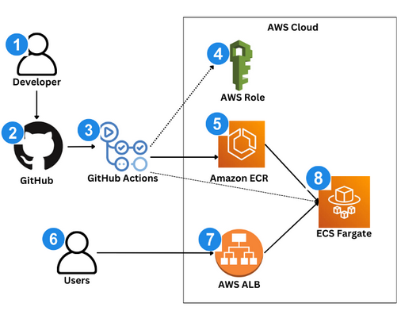

# 🍔 Food Menu CI/CD Pipeline 

A production-grade CI/CD pipeline for a containerized food delivery application deployed on AWS using ECS Fargate, ECR, and GitHub Actions.

This project demonstrates how modern SaaS teams automate deployments to achieve **zero-downtime releases, scalability, and consistency across environments**.

---
## 📋 The Challenge

FreshEats, a fast-growing food delivery startup, is rapidly adding new features to its backend services to support menus, pricing updates, and promotions.

Currently, the engineering team:

- Builds and deploys applications manually
- Runs updates directly on servers
- Faces downtime during deployments
- Experiences inconsistent environments across releases

As the platform scales, this approach leads to:

- Slower release cycles
- Deployment errors
- Difficulty rolling out fixes quickly
- Increased operational risk

---
## 🏗️Architecture



Designed and implemented a fully automated CI/CD pipeline that takes application code from development to production without downtime:

1. **Developer** pushes code to **GitHub** (main branch).
2. **GitHub Actions** triggers CI/CD workflow.
3. Workflow builds **Docker** image.
4. Workflow authenticates to **AWS(IAM)** and pushes
image to **ECR**.
5. Workflow updates **ECS** Service (new task definition
referencing the new **ECR image**).
6. **ECS** starts new **Fargate** tasks (pulls image from ECR).
7. **ALB** routes user traffic to healthy **ECS tasks** (load
balanced).
8. Users access the app using the **ALB URL**.

---
## 🛠️ Technologies Used

- Docker → Containerize the application
- Amazon ECR → Store and manage container images
- Amazon ECS (Fargate) → Run containers without managing servers
- Application Load Balancer → Route traffic to containers
- AWS IAM → Manage secure permissions for services and CI/CD
- GitHub Actions → Build and deploy the application automatically
- Amazon CloudWatch → Monitor logs and task execution

---
## 📁 Project Structure

```
food-menu-service/
├── .github/
│   └── workflows/ 
│   └── deploy.yml     # GitHub Actions CI/CD workflow
├── node_modules/      # Installed Node.js dependencies
├── server.js          # Application entry point
├── Dockerfile         # Docker container configuration
├── public/            # Static assets
└── package.json       # Application dependencies and start script
```
## 🚀 Key Features

- **Automated CI/CD Pipeline** - Instant deployments on git push
- **Version control** - Infrastructure changes now tracked in Git with full history
- Zero-downtime deployments
- Scalable serverless architecture
- Containerized microservice
- Traffic is managed through an **Application Load Balancer**

---

